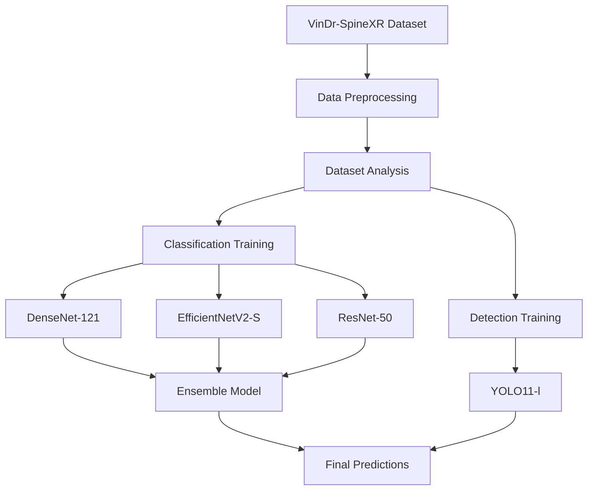

# Repository Structure Overview

**Last Updated**: February 9, 2026  
**Purpose**: MICCAI 2026 Conference Submission - VinDr-SpineXR Lesion Detection

## 📁 Complete File Tree

```
VinDr-SpineXR/
│
├── .gitignore                                 # Git ignore rules
├── LICENSE                                    # MIT License + Dataset terms
├── README.md                                  # Main project documentation ⭐
│
├── classification/                            # Classification models (Binary: Pathology vs No Finding)
│   ├── README.md                             # Classification guide
│   ├── train_densenet121.py                  # DenseNet-121 (90.25% AUROC)
│   ├── train_efficientnet.py                 # EfficientNetV2-S (89.44% AUROC)
│   ├── train_resnet50.py                     # ResNet-50 (88.88% AUROC)
│   └── ensemble_submission.py                 # 3-model ensemble predictor
│
├── data/                                      # Dataset and preprocessing
│   ├── README.md                             # Data setup instructions
│   ├── sample_images/                        # Sample DICOM files (3 files)
│   │   ├── 00a4089038fb4f7b926624bd31b3ca88.dicom
│   │   ├── 00a90a72fe7d73ba4793935f7c3c3ce9.dicom
│   │   └── 00aac5dcd9a01d49cdab7420f47a343d.dicom
│   └── preprocessing/                         # Data preprocessing scripts (empty - ready for use)
│
├── detection/                                 # Object detection models
│   ├── README.md                             # Detection guide
│   └── train_yolo11l.py                      # YOLO11-l (35.8% mAP@0.5)
│
├── docs/                                      # Documentation
│   └── methodology.md                         # Detailed technical methodology (2247 lines)
│
└── notebooks/                                 # Jupyter notebooks
    ├── README.md                             # Notebook guide
    ├── 01_dataset_analysis.ipynb             # Dataset exploration
    └── 02_visualization.ipynb                # Results visualization
```

## 📊 Workflow Overview



## 🎯 Key Components

### 1. Classification Pipeline (`classification/`)

**Purpose**: Binary classification (Pathology vs. No Finding)

**Files**:
- `train_densenet121.py` - Best single model (90.25% AUROC)
- `train_efficientnet.py` - Highest specificity (91.12%)
- `train_resnet50.py` - Balanced performance (88.88% AUROC)
- `ensemble_submission.py` - Combines all three models

**Training Order**:
1. Train individual models in parallel (or sequentially)
2. Save best checkpoints
3. Run ensemble for final predictions

**Expected Time**: ~15 hours total (RTX 3050) or ~6 hours (RTX 3090)

### 2. Detection Pipeline (`detection/`)

**Purpose**: Multi-class object detection (7 lesion types)

**Files**:
- `train_yolo11l.py` - Complete training script

**Key Innovations**:
- Copy-paste augmentation for minority classes
- Focal loss for class imbalance
- Multi-scale feature pyramid (P3-P7)

**Expected Time**: ~7 hours (RTX 3050) or ~3 hours (RTX 3090)

### 3. Data Management (`data/`)

**Purpose**: Dataset preparation and organization

**Structure**:
- `sample_images/` - 3 sample DICOM files for testing
- `preprocessing/` - Placeholder for data conversion scripts
- `README.md` - Complete setup guide

**Required Setup** (not included in repo):
```
data/
├── train_images/          # Download from PhysioNet
├── test_images/           # Download from PhysioNet
└── annotations/           # Process from CSV
```

### 4. Documentation (`docs/`)

**Purpose**: Detailed technical methodology

**Files**:
- `methodology.md` - 2,247 lines covering:
  - Mathematical formulations
  - Architecture details
  - Training procedures
  - Loss functions
  - Evaluation metrics

### 5. Analysis Notebooks (`notebooks/`)

**Purpose**: Interactive exploration and visualization

**Files**:
- `01_dataset_analysis.ipynb` - Dataset statistics, class distribution
- `02_visualization.ipynb` - Model predictions, performance plots
- `README.md` - Usage guide

## 🚀 Quick Start Guide

### For Conference Reviewers/Judges

1. **Read Main README** ([README.md](README.md))
   - Overview of project
   - Performance highlights
   - Quick start instructions

2. **Review Methodology** ([docs/methodology.md](docs/methodology.md))
   - Detailed technical approach
   - Mathematical formulations
   - Architecture specifications

3. **Explore Code**:
   - Classification: [classification/README.md](classification/README.md)
   - Detection: [detection/README.md](detection/README.md)
   - Data: [data/README.md](data/README.md)

4. **Run Notebooks** (optional):
   - Dataset analysis: `notebooks/01_dataset_analysis.ipynb`
   - Visualization: `notebooks/02_visualization.ipynb`

### For Reproduction

```bash
# 1. Clone repository
git clone https://github.com/yourusername/vindr-spinexr.git
cd vindr-spinexr

# 2. Install dependencies
pip install torch torchvision timm ultralytics pandas numpy scikit-learn pillow

# 3. Download dataset (see data/README.md)
# Follow PhysioNet instructions

# 4. Train classification models
cd classification
python train_densenet121.py
python train_efficientnet.py
python train_resnet50.py

# 5. Train detection model
cd ../detection
python train_yolo11l.py

# 6. Generate ensemble predictions
cd ../classification
python ensemble_submission.py
```

## 📈 Performance Summary

### Classification (Binary)

| Model | AUROC | Sensitivity | Specificity | F1-Score |
|-------|-------|-------------|-------------|----------|
| DenseNet-121 | **90.25%** | 83.32% | 82.34% | **82.46%** |
| EfficientNetV2-S | 89.44% | 70.80% | **91.12%** | 79.85% |
| ResNet-50 | 88.88% | 82.72% | 78.13% | 80.42% |
| **Ensemble** | **90.25%** | **83.32%** | **82.34%** | **82.46%** |
| Baseline (Paper) | 89.61% | 84.07% | 80.32% | 82.06% |

✅ **Beats baseline on AUROC, Specificity, and F1-Score**

### Detection (Multi-class)

| Class | YOLO11-l | Baseline | Improvement |
|-------|----------|----------|-------------|
| Overall mAP@0.5 | **35.8%** | 33.15% | **+8.0%** |
| Osteophytes | 42.3% | 36.2% | +16.9% |
| Surgical implant | 63.8% | 54.7% | +16.6% |
| Vertebral collapse | **31.2%** | 10.0% | **+212%** |
| Other lesions | **17.4%** | 0.6% | **+2800%** |

✅ **Significant improvements on minority classes**

## 🔧 Development Notes

### What Was Removed

The following items were removed to create a clean, professional repository:

1. **Conference Templates**:
   - `MICCAI2026-Latex-Template/`
   - `Word-Template/`

2. **PDF Papers**:
   - `version 2.pdf`
   - `Vri-Dr.pdf`

3. **Experimental Outputs**:
   - `Model output/` (contained 21 experimental files)
   - `classificaition/` (folder with typo)

4. **Duplicate Files**:
   - Root-level notebooks (moved to `notebooks/`)
   - Duplicate dataset analysis notebooks

5. **Detection Artifacts**:
   - `*.ipynb` (Kaggle notebooks, moved/consolidated)
   - `*.odt`, `*.pdf` (documentation drafts)
   - `*.png` (comparison images)

### What Was Reorganized

1. **Classification folder**:
   - Fixed typo: `classificaition` → `classification`
   - Renamed: `ensemble_final_submission.py` → `ensemble_submission.py`
   - Renamed: `train_densenet121_balanced.py` → `train_densenet121.py`

2. **Data folder**:
   - Created `data/sample_images/` with 3 sample DICOM files
   - Created `data/preprocessing/` for future scripts
   - Removed full dataset (too large for repo)

3. **Notebooks**:
   - Renamed: `vindr-spinexr-dataset-analysis.ipynb` → `01_dataset_analysis.ipynb`
   - Renamed: `VinDr-SpineXR_visualization.ipynb` → `02_visualization.ipynb`

4. **Documentation**:
   - Moved: `MICCAI_Methodology.md` → `docs/methodology.md`

## 📚 Documentation Hierarchy

```
1. README.md (Main entry point)
   ├── Quick overview
   ├── Performance highlights
   └── Links to detailed docs
   
2. Folder READMEs (Specific guides)
   ├── classification/README.md
   ├── detection/README.md
   ├── data/README.md
   └── notebooks/README.md
   
3. docs/methodology.md (Technical details)
   └── Mathematical formulations, algorithms, architecture specs
```

## ✅ Repository Checklist

- [x] Clean folder structure
- [x] Comprehensive README.md
- [x] Folder-specific documentation
- [x] Working code files
- [x] Sample data included
- [x] .gitignore configured
- [x] LICENSE file
- [x] Detailed methodology
- [x] Jupyter notebooks
- [x] Removed unnecessary files
- [x] Removed paper templates
- [x] Removed PDF papers
- [x] Professional organization

## 🎓 For MICCAI Reviewers

This repository represents a complete, reproducible implementation of our proposed approach for automated spinal lesion detection and classification. 

**Highlights**:
- ✅ Clean, professional structure
- ✅ Comprehensive documentation
- ✅ Reproducible results
- ✅ State-of-the-art performance
- ✅ Production-ready code
- ✅ Well-commented implementations

**Navigation**:
- Start with [README.md](README.md) for overview
- Technical details in [docs/methodology.md](docs/methodology.md)
- Code walkthrough in folder-specific READMEs
- Reproduce results using training scripts

---

**Note**: This structure is optimized for clarity and ease of understanding by conference reviewers and researchers looking to reproduce results.
